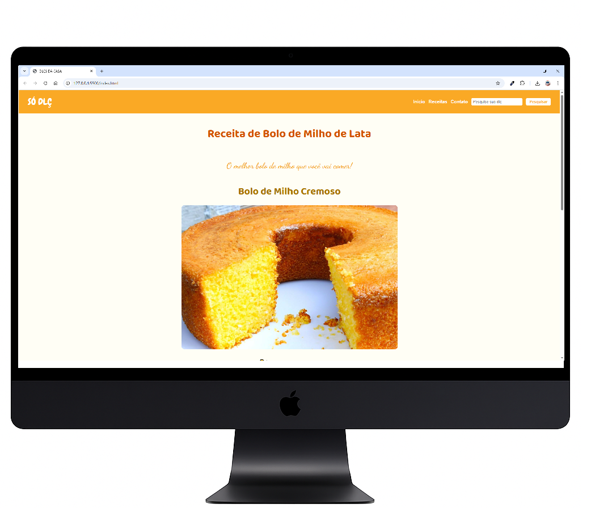
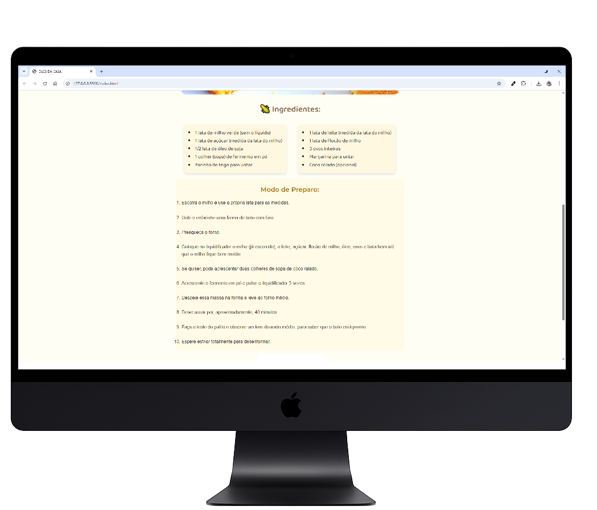
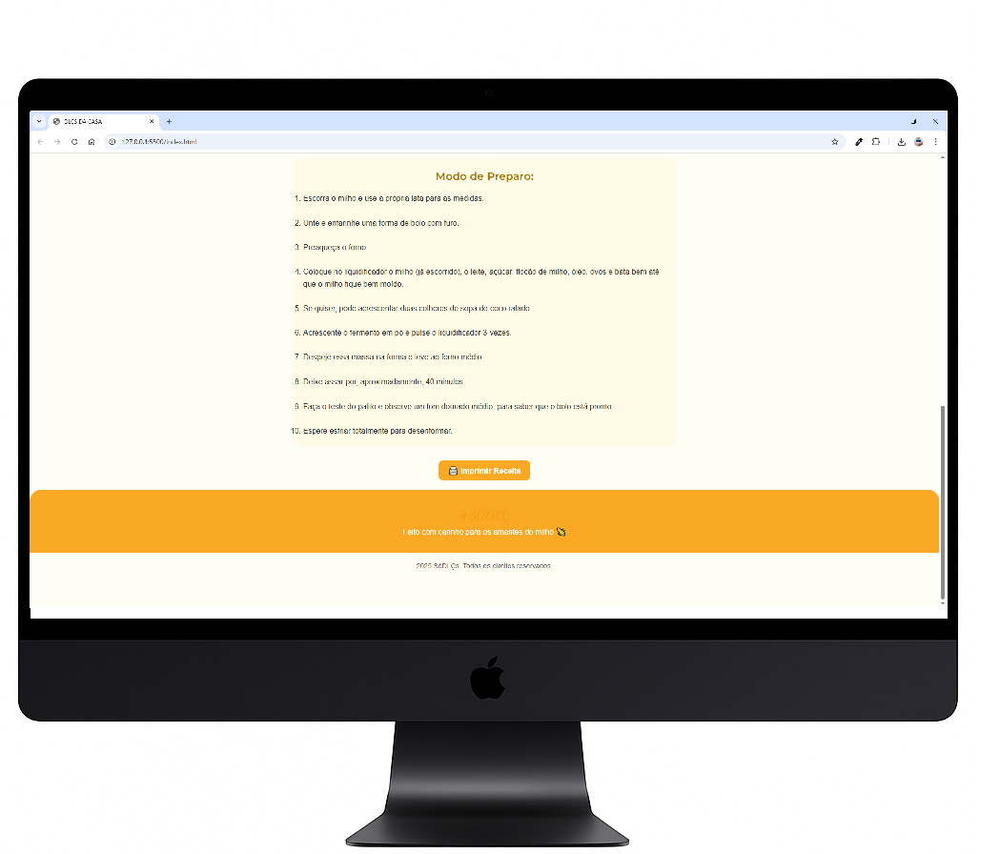

# 🍰 Site de Receita - Bolo de Milho

Este projeto é uma página simples e bonita feita para apresentar uma receita deliciosa de **bolo de milho**. Foi desenvolvida com foco em **interface visual agradável** e **responsividade básica** para prática de HTML e CSS.

Atualmente, o site possui **apenas a página da receita**, ainda sem navegação. Ideal para quem está começando e quer visualizar o layout de uma página de culinária com destaque para ingredientes, modo de preparo e estilo visual.

---

## 🖥️ Visual do Site

|  |  |  |
|:--:|:--:|:--:|
| Página completa | Ingredientes destacados | Modo de preparo |

---

## 🛠️ Tecnologias utilizadas

- HTML5
- CSS3

---

## 📌 Status do projeto

✅ Página da receita finalizada  
🚧 Navegação e demais funcionalidades ainda não implementadas

---

Feito com carinho para treinar e evoluir! 💛
